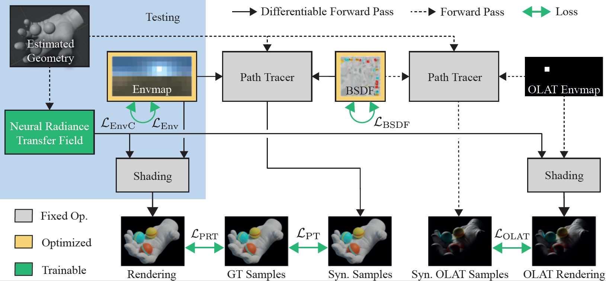

# Neural Radiance Transfer Fields

Pytorch implementation of [Neural Radiance Transfer Fields for Relightable Novel-view Synthesis with Global Illumination](https://people.mpi-inf.mpg.de/~llyu/projects/2022-NRTF/index.htm).

[Linjie Lyu](https://people.mpi-inf.mpg.de/~llyu/)<sup>1</sup>,
 [Ayush Tewari](https://ayushtewari.com/)<sup>2</sup>,
 [Thomas Leimkühler](https://people.mpi-inf.mpg.de/~tleimkue/)<sup>1</sup>,
 [Marc Habermann](https://people.mpi-inf.mpg.de/~mhaberma/)<sup>1</sup>,
 [Christian Theobalt](https://people.mpi-inf.mpg.de/~theobalt/)<sup>1</sup>
 
 
 <sup>1</sup>Max Planck Institute for Informatics,Saarland Informatics Campus , <sup>2</sup>MIT 
 


## Installation

1. Install [Mitsuba2](https://mitsuba2.readthedocs.io/en/latest/) with gpu_autodiff in variants.

2. Set up environment
```python
conda env create -f environment.yml
conda activate NRTF
```
3. Install [Blender](https://www.blender.org/) (2.9.2 tested).

## Data Preparation
Mainly camera poses and segmentation masks(optional) are required. The input images can be captured under one or multiple environment maps. The dataset then needs to be put in the following file structure:

```
image/envmap0/
    0.exr
    1.exr
    ...
image/envmap1/
    0.exr
    1.exr
    ...
mask/
    0.jpg
    1.jpg
    ...
envmap/
    test.exr
mitsuba/
    envmap.png (32×16)
    texture.png (512×512)
mesh/
     mesh.obj (after the geometry reconstruction)
cameras.npz
olat_cameras.npz
test_cameras.npz
```
cameras.npz should match the poses of the input (ground truth) images. olat_cameras.npz includes the sampled (usually 200-300) camera parameters for OLAT synthesis. 

Please refer to blender/camera_poses for more detail on how to output the camera parameters from your blender camera.

## Usage

1. Geometry Reconstruction  

   We use this [implementation](https://github.com/ventusff/neurecon) of [NeuS](https://arxiv.org/abs/2106.10689). 
* Clone the [repository](https://github.com/ventusff/neurecon). Prepare your data following their Readme. 
* The camera parameter format of NeuS is slightly different from ours. You can replace their /dataio/DTU.py with our /NeuS/DTU.py to run their script with our camera parameter format.
* You should use neus.yaml as the config when running their script. 
* Run NeuS with your data, and get the reconstructed mesh.
* Note that you can raise the marching cube resolution to extract the mesh from SDF with better geometry details.

2. Material Estimation 
 
   Before running Mitsuba2 for initial material estimation, check UV mapping in /blender. Put the post-processed mesh and an example image of texture and environment map under the data folder.

```python
cd src
python mitsuba_material.py --data_dir $data_root--scene $scene --output_dir $output_root
```
3. Render Buffers for OLAT views
  
   Store position and view direction buffers for each view.
```python
python render_buffer.py --data_dir $data_root  --scene $scene --output_dir $output_root
```
4. OLAT synthesis 

   Please refer to OLAT synthesis in [blender](./blender/README.md)

5. Train Network (overfitting to OLAT synthesis)

```python
python train_olat.py --data_dir $data_root  --scene $scene--output_dir $output_root
```
6. Train Network (jointly train with real images)

```python
python train_joint.py --data_dir $data_root --scene $scene --output_dir $output_root
```
7. Test and relight

We use environment map resolution of 32×16.  
```python
python relight.py --data_dir $data_root --scene $scene --output_dir $output_root
```

## Citation
```python
@inproceedings{lyu2022nrtf,
	title = {Neural Radiance Transfer Fields for Relightable Novel-view Synthesis with Global Illumination},
	author = {Lyu, Linjie and Tewari, Ayush and Leimkuehler, Thomas and Habermann, Marc and Theobalt, Christian},
	year = {2022},
	booktitle={ECCV},
}
```